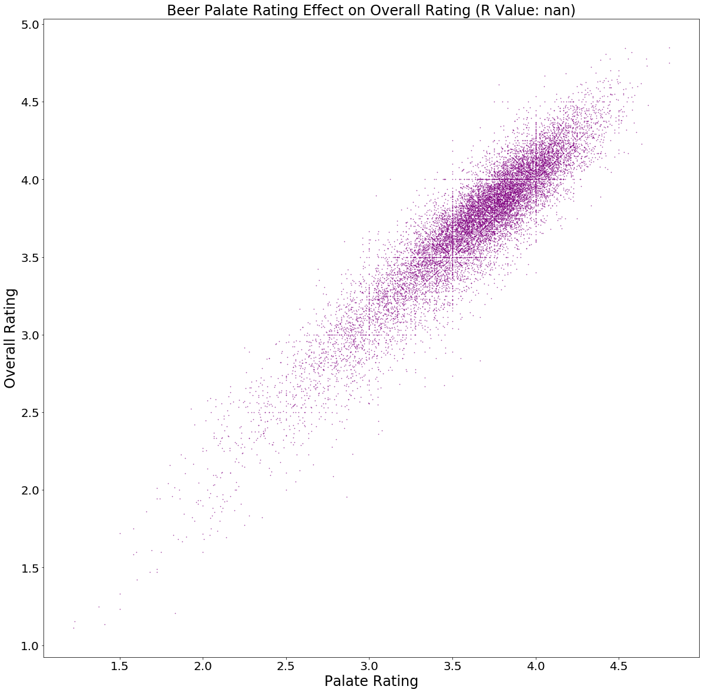
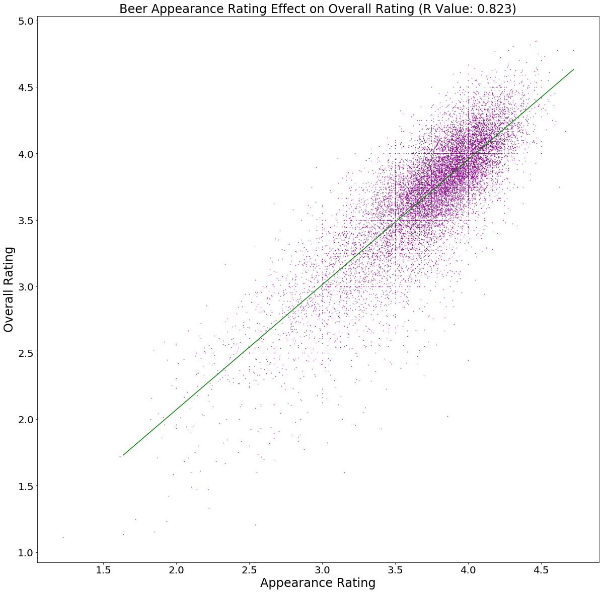
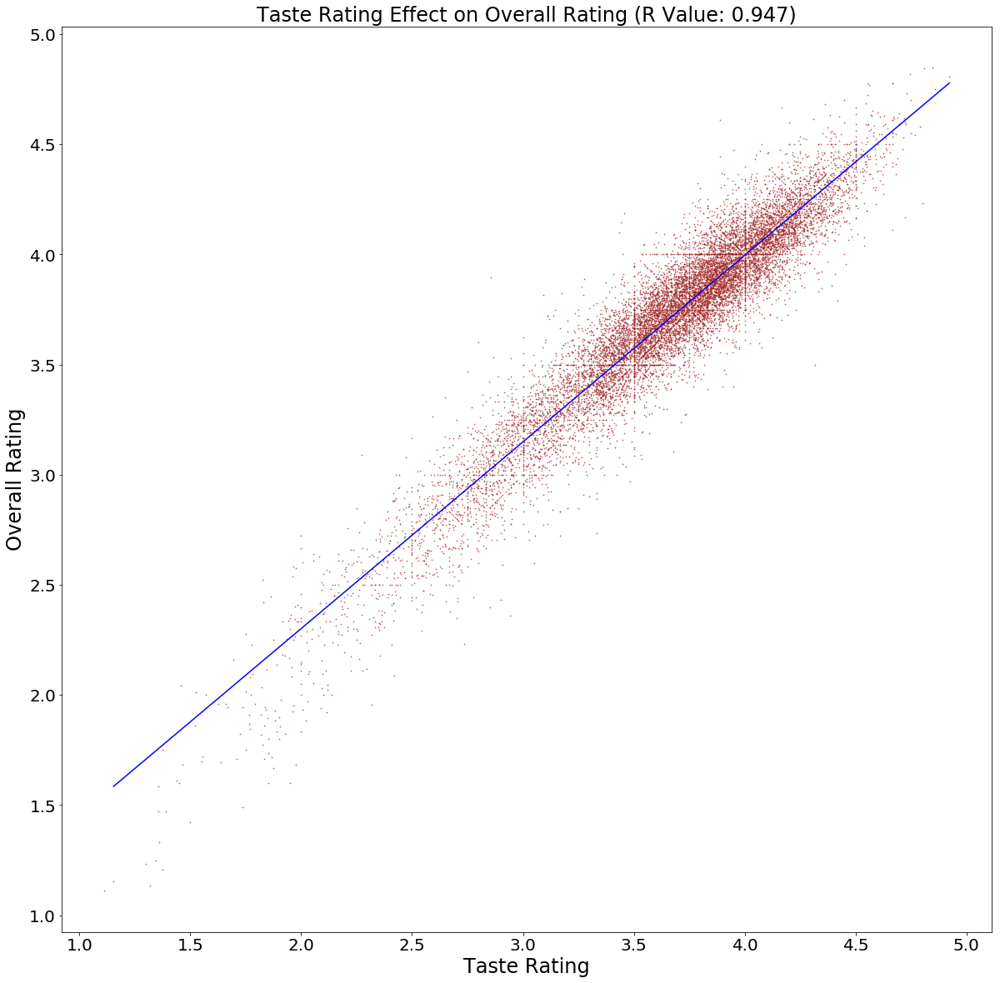
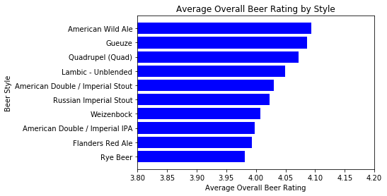

# Beer-Data-Project

*Group Members: Brandon Fick, Jacob Kreitler, Carlos Soriano, Jacob Lingwall*

*Files - The main files are Beer_Data_Analysis and Beer_Data_Cleaning.  You can find the figures in the plots folder.  Also the cleaned csv files are in the clean_data folder.*

*To be able to run the code you will need to download the dataset separately since it is too big to upload to github.  Be sure to store the csv file in the parent directory from where you store the code or edit the code to read the file from where you end up storing it.*

# Write Up

This project was based on a beer review dataset found on Kaggle. It can be found here: https://www.kaggle.com/rdoume/beerreviews.  The dataset includes roughly 1.5 million beer reviews from beers all over the world.  

The purpose of this project was to determine what factors affect a beer's review rating the most.  The analysis is trying to help a person create a great beer that will have rave reviews.  The project takes a look at three different questions, two of them specifically related to the beer and the third to the location of the brewery.

### Question 1:

The first question we wanted to answer was what the properties of a beer give it the best rating.  The dataset provided an overall rating along with ratings for taste, appearance, palatte, and  aroma.  Since beers could have multiple reviews, the data was cleaned to create a csv file that represented an average for all these different reviews for each beer.  Using this csv file an analysis was made using scatter plots.  The analysis invovled determining which property (taste, appearance, palatte, or aroma) had the best correlating effect on the overall rating of the beer.  Through the analysis it was determined that the most effective property is taste.

### Question 2:

The second question we wanted to answer was what style/type of beer was most popular.  The dataset was sorted and cleaned to create a csv file containing the total reviews each style received, the number of beers of each style, and the average overall rating of each style.  The analysis involved creating bar charts of each of the three categories for the top ten beer styles in each. The total reviews and number of beers charts each showed that an American IPA is the most popular beer.

### Question 3:

The third question we wanted to answer was where are the breweries in U.S with the highest average beer rating.  The dataset was sorted by brewery and then the google places api was used to find the latitude and longitude of each.  The data was then sorted to remove breweries that were not in the U.S. and stored in a csv file.  The analysis involved binning the breweries by ratings.  Then gmaps was used to create heat maps of each ratings bin.  This showed which areas of the U.S. turn into hotspots for higher rated beers. Finally a GIF was made to give a moving image of the concentration of breweries with high rated beer.

